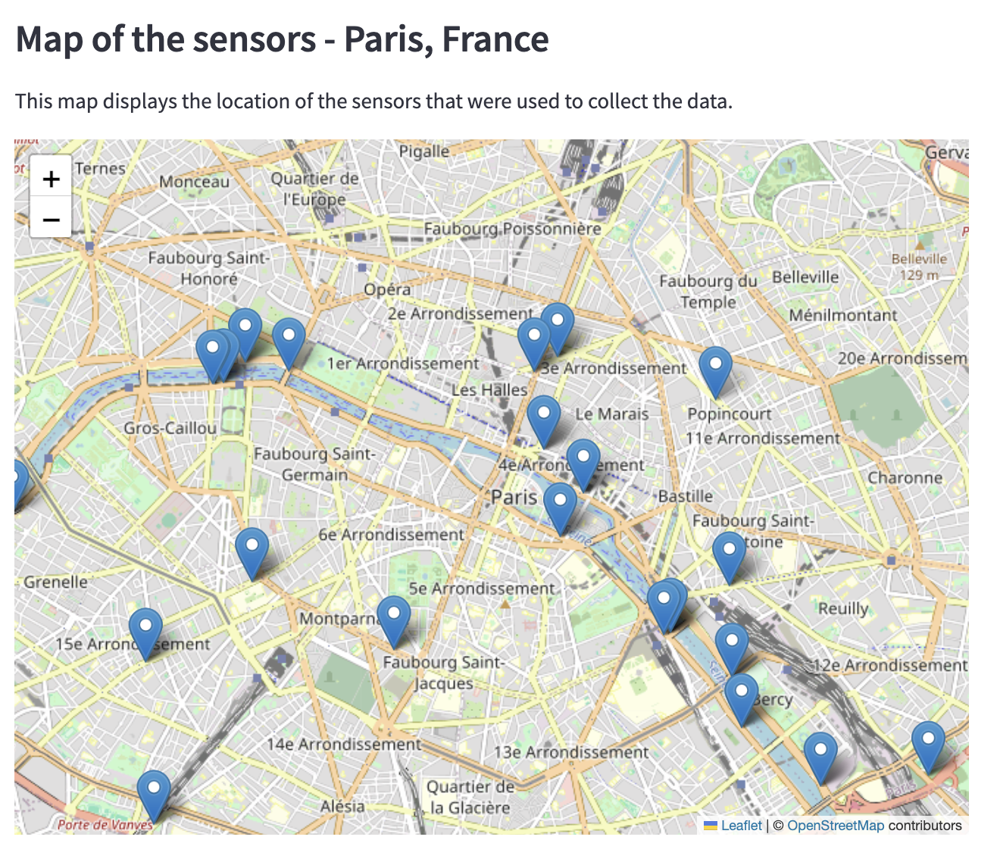

# Streamlit project for HEC course
Created a streamlit app from a data science project on bike counts in Paris.
Gives an idea of the changes in distribution of the number of cyclists by weekday, depending of the month.
The dataset for this project spans from September 2020 to August 2021.

The app was containerized using Docker

